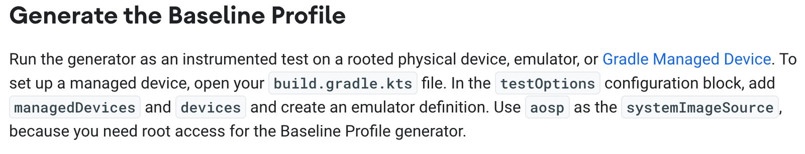
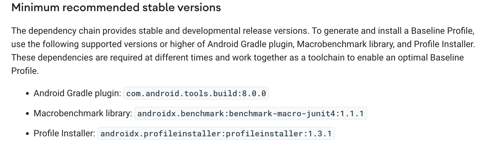
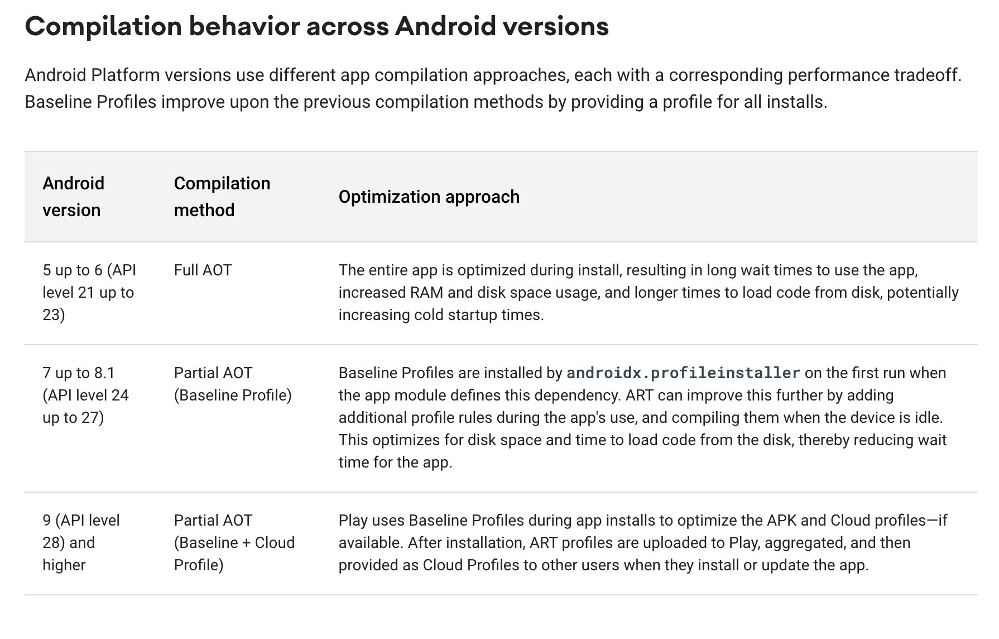

# BaselineProfileApplication

**Application to test `baselineprofile` library under a clean install**

**Guide**

_Run the following command to generate the baseline-prof.txt file._

`./gradlew :app:generateReleaseBaselineProfile -Pandroid.testInstrumentationRunnerArguments.androidx.benchmark.enabledRules=BaselineProfile`

The generated file will be found under `build` package of `baselineprofile` module. 
Go to outputs then to `connected_android_test_additional_output` folder and look for the device used on tests.

_Run the following command to collect application startup and journeys metrics._

`./gradlew :baselineprofile:connectedAndroidTest -Pandroid.testInstrumentationRunnerArguments.androidx.benchmark.enabledRules=Macrobenchmark`

**Discoveries**

- We don't need `macrobenchmark` library import, just `baselineprofile` and `profileinstaller`.
- BaselineProfile needs his own module, like `macrobenchmark`.
- Using alpha versions of `baselineprofile` library allows run baseline generating tasks without rooted physical devices.
- Maybe it's necessary upgrade gradle to 8.0.0 or above versions.
- BaselineProfile library already contains `macrobenchmark` jetpack library. The opposite is not true.

**How the Baseline Profile works**

**Recommended libraries versions**

**Compilation behavior across Android Versions**

**Results:**

**Success cases of Baseline Profile use**

- https://developer.android.com/stories/apps/tiktok
- https://developer.android.com/stories/apps/lyft
- https://developer.android.com/stories/apps/zomato
- https://developer.android.com/stories/apps/josh

**Baseline Profile documentation**

- https://developer.android.com/topic/performance/baselineprofiles/overview

